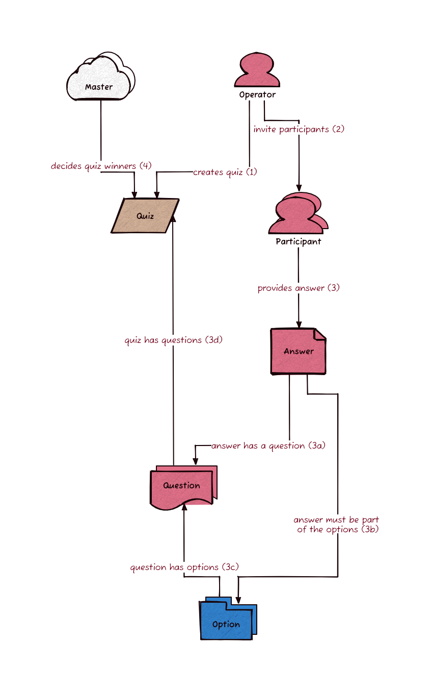

# LearnWay App

- This app incentivizes people to learn together in a competitive approach.
- In simple terms, there is a quiz and there are multiple participants of the quiz.
- At the end of the quiz the top winners get a prize.
- The interesting part is that, to participate in a quiz, one must stake a given amount.
- Aside quizes there are lessons that one can take 

## Functional Requirements

- Players should be able to create quizes
- Players should be able to manage quizes;
  - Start quiz
  - Invite player
  - Cancel quiz
- Players should be able to join quizes
- Players should be able to invite others to quizes.
- Players should receive rewards upon winning.
- Players should see leaderboard
- Players should be able to take lessons
- Players should be able to take quiz on lesssons

## Non-Functional Requirements

- Core quiz settlement components should be built with the blockchain.
- Should be able to handle concurrent quizes with multiple participants.
- Should be fast and responsive such that it does not seem slow.

### Entities

- Participant: people engaging in the quizes.
- Question: an single inquiry that needs to be answered.
- Option: options within a question that people will choose.
- Answer: the answer of the quiz, can be one or more options.
- Quiz: a competion in which participants answer questions and win prizes.
- Operator: entity that manages the quiz, probably started the quiz, and completed.
- Master: entity responsible for;
  - generating the quiz.
  - evaluating the quiz.
  - providing the actual answers which will be used to determine winners.
  - functionality is handled by the LearnWay quiz master.
  - currently LearnWay quiz master is centralized.
  - allowing other quiz master implementations to plugin to learnway system can be considered.
- Lesson: information that user can study and take quizes about.

#### Entity Relation Diagram



### Flows

- Authenticate:  How new users are going to authenticate.
- Learn & Earn: How learn & Earn works.
- Create Quiz; How to create quiz.
- Invite Participants: How to invite participants to a quiz.
- Join Quiz: How invited participants can join quiz.
- Start Quiz: How to start a quiz.
- Submit Answers: How to submit one's answers for a quiz.
- Cancel Quiz: How to cancel a quiz.
- End Quiz: How to end a  quiz.
- Evaluate Quiz: How will the quiz be evaluated after it has ended.

#### Authenticate

#### Learn & Earn

1. Must be signend in.

#### Create Quiz

1. Must be signend in.
2. Provide quiz parameters.
3. Create quiz and invite participants.

#### Invite Participants

1. Must be signend in.
2. Create a quiz.
3. Add participants to a quiz.
  a. Can add participant account ID / address and generate invite link for them.
  b. Invite can also popup as notification to participant.
  c. Can copy link and share for various
4. Invited participant join before quiz is started.
5. Invited participant can't join after quiz is started.

#### Join Quiz

1. Must be signend in.
2. Participant must have permission to join quiz.
3. Participant can submit answers once quiz is started.

#### Start Quiz

1. Must be signend in.
2. Quiz can be started by operator

#### Submit Answers

1. Must be signend in.
2. Quiz must already be started.
3. Provide answer for each question.
4. 

#### Cancel Quiz

1. Must be signend in.
2. Quiz can only be cancelled if it has not started.
3. Operator can cancel quiz which will prevent it from being ever started.
4. Participants who already joined and staked can withdraw their money.

#### End Quiz

1. Must be signend in.
2. All participants must have submitted their answers or quiz deadline reached.
3. Operator can end quiz which will alert quiz master to grade the quiz.

#### Evaluate Quiz

1. Quiz must have ended.
2. Quiz master bot will evaluate the quiz.
3. Participants should be able to see

## System Components

Top-level components of the learnway backend system.

1. Quiz Master

## Spec

In-depth protocol spec for data types, functional logic, backend and smart contract.

### Question

```typescript
type Option = string;
type Question = {
  question: string, // actual question
  options: Option[]
};
```

### Quiz

```typescript
type Quiz = {
  topic: string, // from a list of predetermined topics
  questions: Question,
};
```

### Answer

```typescript
type Answer = {
  questionId: string, // 
  answer: string, // 
};

type Submission = {
  quizId: string, //
  answers: Answer[] // 
}
```

### Participant

```typescript
type Participant = {
  address: string, //
  quizId: string, //
  submission: Submission
};
```
